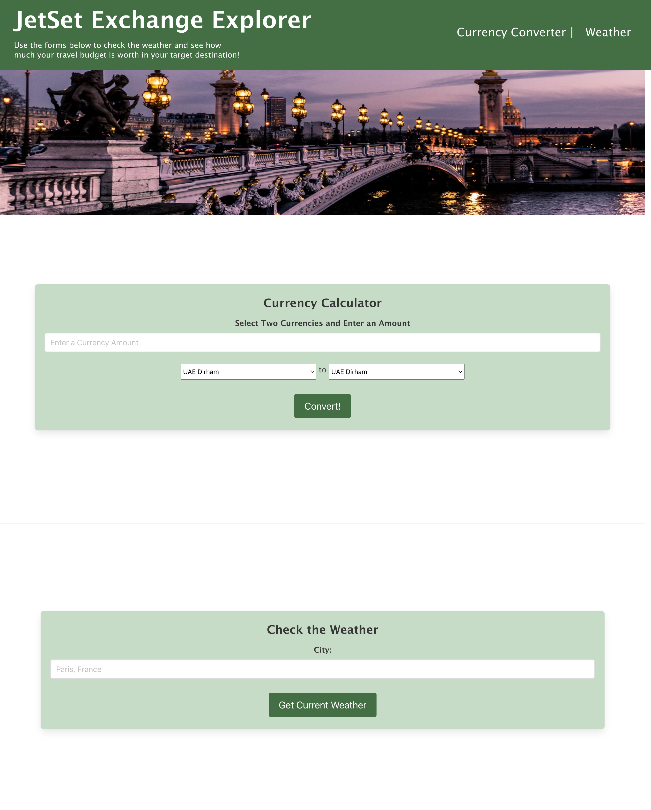

# JetSet Exchange Explorer 

## Description

Created code from scratch for an informative website that helps prospective travelers get currency exchange totals by entering their budgeted amount and selecting the desired currency, as well as view the weather forecast in their target destination.

## Installation

N/A

## Usage

This website can be used to see how much your travel budget is worth in the currency of the country you are traveling to and view the current weather in a destination of your choosing. 

[Link to JetSet Exchange Explorer webpage](https://github.com/crcarmen23/jetset-exchange-explorer)

## Credits

Carmen Regina, Conor Reed, Kevin Serrano, and Zechiel Lozer with help from Leif Hetland and Fred Kamm.

## License

Please refer to the LICENSE in the repo.